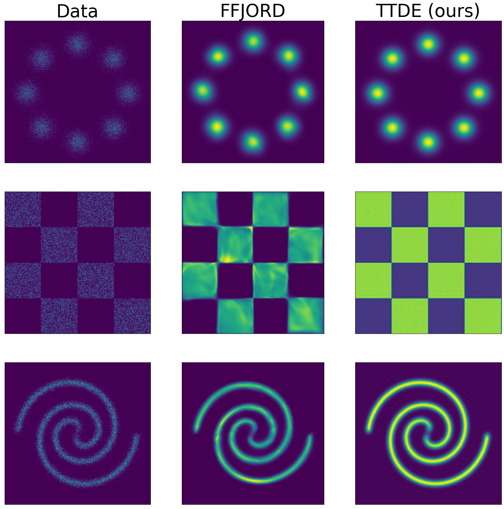
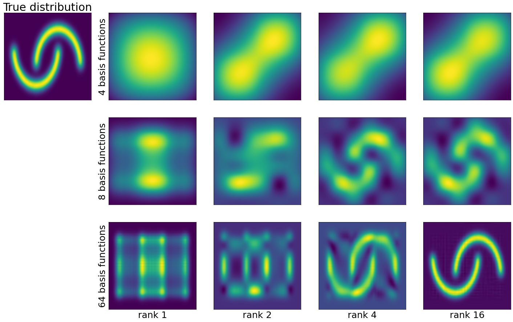

Code for reproducing experiments from this paper:
>Novikov, Georgii S., Maxim E. Panov, and Ivan V. Oseledets. "Tensor-train density estimation." Uncertainty in artificial intelligence. PMLR, 2021. 
>[paper](https://proceedings.mlr.press/v161/novikov21a.html)

If you use our code in your research, please cite our paper:
```
@inproceedings{Novikov21,
  author    = {Georgii S. Novikov and
               Maxim E. Panov and
               Ivan V. Oseledets},
  editor    = {Cassio P. de Campos and
               Marloes H. Maathuis and
               Erik Quaeghebeur},
  title     = {Tensor-train density estimation},
  booktitle = {Proceedings of the Thirty-Seventh Conference on Uncertainty in Artificial
               Intelligence, {UAI} 2021, Virtual Event, 27-30 July 2021},
  series    = {Proceedings of Machine Learning Research},
  volume    = {161},
  pages     = {1321--1331},
  publisher = {{AUAI} Press},
  year      = {2021},
  url       = {https://proceedings.mlr.press/v161/novikov21a.html},
  timestamp = {Fri, 17 Dec 2021 17:06:27 +0100},
}
```

# Table of Contents

- [Tensor-Train Density Estimation](#tensor-train-density-estimation)
  - [Tensor-Train compression of the linear model](#tensor-train-compression-of-the-linear-model)
  - [Density Estimation](#density-estimation)
  - [Choice of Basis Functions](#choice-of-basis-functions)
  - [Results](#results)
  - [Hyperparameters](#hyperparameters) 
- [Installation](#installation)
- [How To Run](#how-to-run)
  - [Data Preparation](#data-preparation)
  - [Training](#training)

# Tensor-Train Density Estimation

  Tensor-Train Density Estimation (TTDE) is a method of estimating the unknown probability distribution given samples (dataset) from that distribution. It combines the flexibility and tractability of linear models with computational and memory efficiency thanks to Tensor-Train low-rank tensor decomposition. Neural network-based models that solve the same task (like VAEs, GANs, Normalizing flows, and others), despite the exceptional expressiveness, usually provide a very narrow range of probabilistic inference possibilities. In most cases, a trained neural network-based model gives access only to sampling and evaluating probability at a point. TTDE gives a much wider range of possibilities, including:
  * Marginal distributions
  * Cumulative distributions 
  * Sampling (and reparameterization trick is possible thanks to tractable cumulative distributions and gradient of implicit function)
  * Taking expectations
  
  TTDE is not as expressive as neural network-based models and is best suited for medium-dimensional data.

## Tensor-Train compression of the linear model

  To better understand how TTDE works consider linear parametrization of a one-dimensional model: take some set of basis functions 

  $$ \\{f_i\\}_{i=1}^{n}, f_i : \mathbb{R} \rightarrow \mathbb{R} $$

  and construct function $q_\alpha$ with vector of parameters $\alpha \in \mathbb{R}^n$ in the following way:
  
  $$ q_{\alpha}(x) = \sum_i \alpha_i f_i(x) = \left< \boldsymbol{\alpha}, \boldsymbol{f}(x) \right>, \boldsymbol{\alpha} \in \mathbb{R}^n, $$
  
  $$ \boldsymbol{f}(x) = \left( f_1(x), \cdots, f_n(x) \right) \in \mathbb{R}^n. $$

  Because basis functions are fixed and do not depend on model parameters, it is easy to integrate functions in this form (and thus be able to calculate cumulative-marginal-conditional distributions):

  $$\int q_{\boldsymbol{\alpha}}(x) dx = \left< \boldsymbol{\alpha}, \int \boldsymbol{f}(x) dx \right>,$$

  $$\int q_{\boldsymbol{\alpha}}^2(x) dx = \left< \boldsymbol{\alpha}, \left( \int \boldsymbol{f}(x) \boldsymbol{f}^T(x) dx \right) \boldsymbol{\alpha}\right>.$$

  **$d$-dimensional case.** To generalize this linear model to $d$-dimensional case, we have to construct some set of $d$-dimensional basis functions. An easy way to obtain such a set is to consider the cartesian product in the following form:

  $$f_{i_1, \cdots, i_d}(\boldsymbol{x}) = f_{i_1}(x_1) \cdots f_{i_d}(x_d).$$

  Basis constructed in this way will be exponentially large, but that guarantees expressivity. Both linear parameters of function $q_\boldsymbol{\alpha}$ and features of input vector $\boldsymbol{x}$ can be structured as a $d$-dimensional tensor of size $n \times \cdots \times n$:
  
  $$ \boldsymbol{\alpha} \in \mathbb{R}^{n^d}, $$

  $$ \boldsymbol{F}(x) = \boldsymbol{f}(x) \otimes \cdots \otimes \boldsymbol{f}(x)  \in \mathbb{R}^{n^d}, $$

  $$ q_{\boldsymbol{\alpha}}(\boldsymbol{x}) = \left< \boldsymbol{\alpha}, \boldsymbol{F}(\boldsymbol{x}) \right>, $$

  and all previous conclusions with tractable integrals still hold.

  **Tensor-train low-rank decomposition.** To be able to work with such a linear model in a high-dimensional setting we need to be able to store and operate with exponentially-large tensors. In our work, we suggest compressing weight tensor $\alpha$ with low-rank tensor decomposition called [tensor-train decomposition](https://epubs.siam.org/doi/abs/10.1137/090752286). It allows us to store large tensors and perform the necessary operations for us (inner product and quadratic form) in polynomial memory and time.


## Density Estimation
  $q_{\alpha}$ can be directly used as unnormalized probability density with tractable partition function and constraint that $\left< \boldsymbol{\alpha}, \boldsymbol{F}(\boldsymbol{x}) \right> \geq 0 \forall \boldsymbol{x}$ which is easily achievable by choosing strictly positive basis functions $F$ and weight tensor $\boldsymbol{\alpha}$.


  Another approach is to parameterize probability density as $q_{\boldsymbol{\alpha}}^2$. This way we do not need nonnegativity constraints.


  Because the partition function for the TTDE model is tractable we can train weight tensor $\alpha$ with standard log-likelihood maximization:

  $$ \sum_{i=1}^{N} \log \frac{q_{\boldsymbol{\alpha}}^2(\boldsymbol{x}_i)}{\int q_{\boldsymbol{\alpha}}^2(\boldsymbol{x}) d\boldsymbol{x}} \rightarrow max_{\boldsymbol{\alpha}} $$


## Choice of Basis Functions

  By choosing the appropriate basis functions set we can achieve different properties of probability density such as differentiability and smoothness. Moreover, the resulting probability distribution can be a discrete distribution w.r.t some variables and a continuous distribution w.r.t. other variables.

  In our work, we use B-splines as one-dimensional basis functions.


## Results

### Model Data
  
  Comparison of TTDE and FFJORD models on 2-dimensional toy distributions.
  
  
  

### UCI datasets

  Average log-likelihood for several neural-network-based models on tabular UCI datasets. Gaussian fitted to the training data is reported as a baseline.

  |                      | POWER  | GAS   | HEPMASS    | MINIBOONE  | BSDS300 |
  |----------------------|--------|------------|------------|-----------|---------|
  | Dataset dimensionality | 6      | 8     | 21         | 43         | 64      |
  | Gaussians            | -7.74  | -3.58 | -27.93     | -37.24     | 96.67   |
  | MADE                 | -3.08  | 3.56  | -20.98     | -15.59     | 148.85  |
  | Real NVP             | 0.17   | 8.33  | -18.71     | -13.84     | 153.28  |
  | Glow                 | 0.17   | 8.15  | -18.92     | -11.35     | 155.07  |
  | FFJORD               | 0.46   | 8.59  | **-14.92** | **-10.43** | **157.40**  |
  | Squared TTDE (ours)  | **0.46** | **8.93** | $-21.34^*$ | $-28.77^*$ | 143.30  | 
  
  *On the Hepmass and Miniboone datasets, which have the lowest number of training examples (300k and 30k respectively), we observe heavy overfitting. Lack of regularizations for the new model leads to poor results. Thus, it is an important direction for the further development of the TTDE.


## Hyperparameters
  An important feature of our model is the great interpretability of the model hyperparameters: basis size and tensor-train rank. The basis size corresponds to the resolution of the approximation. It acts similarly to the number of bins in the very large multidimensional histogram. The rank of the tensor-train decomposition corresponds to the expressive power of the model, i.e. how complex distributions can be built for the given basis size. The dependence of the trained density on both hyperparameters for the celebrated two moons dataset is shown in the following Figure: 
  
  

  We observe the behavior discussed above. Interestingly, if the rank of tensor-train decomposition is not large enough, the method tries to somehow cope with it, adding symmetric artifacts to the distribution.


# Installation

All requirements can be installed via [poetry](https://github.com/python-poetry/poetry):
```
pip install poetry
poetry install git+https://github.com/stat-ml/TTDE
```
WARNING: The `jax` library with poetry is installed without GPU support. We recommend that you install the correct version of `jax` separately after installing packages with `poetry`, following the recommendations from [repository](https://github.com/google/jax).


# How To Run

## Data Preparation


Download tabular data from the UCI dataset collection as described in [MAF](https://github.com/gpapamak/maf). The following examples assume that the data are unzipped into the `~/from-MAF-paper` folder:
```
ls ~/from-MAF-paper

from_MAF_paper/
|-- BSDS300
|   `-- BSDS300.hdf5
|-- cifar10
|   |-- data_batch_1
|   |-- data_batch_2
|   |-- data_batch_3
|   |-- data_batch_4
|   |-- data_batch_5
|   `-- test_batch
|-- gas
|   `-- ethylene_CO.pickle
|-- hepmass
|   |-- 1000_test.csv
|   `-- 1000_train.csv
|-- miniboone
|   `-- data.npy
|-- mnist
|   `-- mnist.pkl.gz
`-- power
    `-- data.npy
```


## Training

Use the `ttde/train.py` script to start training: 
```
Usage: python -m ttde.train [OPTIONS]

Options:
  --dataset [Power|Gas|Hepmass|Miniboone|BSDS300]
                                  Name of the dataset. Choose one of Power,
                                  Gas, Hepmass, Miniboone, BSDS300  [required]
  --q INTEGER                     degree of splines  [required]
  --m INTEGER                     number of basis functions  [required]
  --rank INTEGER                  rank of tensor-train decomposition
                                  [required]
  --n-comps INTEGER               number of components in the mixture
                                  [required]
  --em-steps INTEGER              number of EM steps for model initialization
                                  [required]
  --noise FLOAT                   magnitude of Gaussian noise for model
                                  initialization  [required]
  --batch-sz INTEGER              batch size  [required]
  --train-noise FLOAT             Gaussian noise to add to samples during
                                  training  [required]
  --lr FLOAT                      learning rate for Adam optimizer  [required]
  --train-steps INTEGER           number of train steps  [required]
  --data-dir PATH                 directory with MAF datasets  [required]
  --work-dir PATH                 directory where to store checkpoints and
                                  tensorboard plots  [required]
  --help                          Show this message and exit.
```

Reproduce the results from the article (Table 3) as follows:
```
power:
	python -m ttde.train --dataset power --q 2 --m 256 --rank 16 --n-comps 32 --em-steps 10 --noise 0.01 --batch-sz 8192 --train-noise 0.01 --lr 0.001 --train-steps 10000 --data-dir ~/from-MAF-paper --work-dir ~/workdir
gas:
	python -m ttde.train --dataset gas --q 2 --m 512 --rank 32 --n-comps 32 --em-steps 10 --noise 0.01 --batch-sz 1024 --train-noise 0.01 --lr 0.001 --train-steps 100000 --data-dir ~/from-MAF-paper --work-dir ~/workdir
hepmass:
	python -m ttde.train --dataset hepmass --q 2 --m 128 --rank 32 --n-comps 32 --em-steps 10 --noise 0.01 --batch-sz 2048 --train-noise 0.01 --lr 0.001 --train-steps 10000 --data-dir ~/from-MAF-paper --work-dir ~/workdir
miniboone:
	python -m ttde.train --dataset miniboone --q 2 --m 64 --rank 32 --n-comps 32 --em-steps 10 --noise 0.01 --batch-sz 1024 --train-noise 0.08 --lr 0.001 --train-steps 10000 --data-dir ~/from-MAF-paper --work-dir ~/workdir
bsds300:
	python -m ttde.train --dataset bsds300 --q 2 --m 256 --rank 16 --n-comps 32 --em-steps 10 --noise 0.01 --batch-sz 512 --train-noise 0.01 --lr 0.001 --train-steps 100000 --data-dir ~/from-MAF-paper --work-dir ~/workdir
```
After the training is over, the results can be viewed using the `tensorboard`:
```
tensorboard --logdir ~/workdir
```

In all examples, replace the path `~/from-MAF-paper` with the one where you put the dataset data, and replace `~/workdir/` with the folder where you want the results to be placed in.
